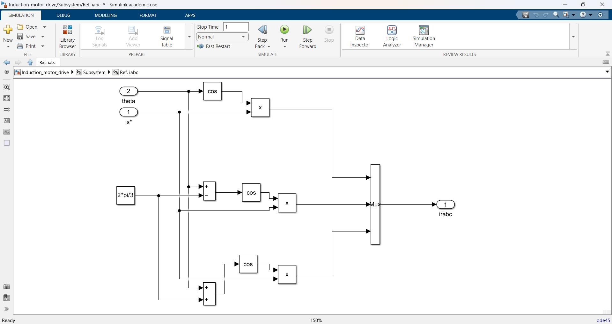

# Simulink Induction Motor Drive Simulation

This repository contains a Simulink model for a detailed simulation of an induction motor drive. The project is designed to demonstrate the behavior and control of a three-phase induction motor using a modern **Field-Oriented Control (FOC)** or **Vector Control** strategy. This simulation is a valuable tool for designing, analyzing, and testing motor control systems.

---

## Project Overview

The core purpose of this model is to simulate the complete motor drive system, from the power supply and conversion to the motor's mechanical output and a responsive closed-loop control system. The simulation is structured to show the performance of the drive under a mechanical load and how the FOC controller manages the motor's speed and torque.

---

## System Architecture

The top-level Simulink model is composed of several key blocks representing the physical components of the motor drive system:

- **Continuous block:** Handles the simulation's time-stepping and continuous-time mode, crucial for modeling dynamic electrical systems.
- **Main circuit block:** Represents the power stage of the drive, likely a DC voltage source, which provides power to the inverter.
- **PWM Inverter block:** A **Pulse Width Modulation (PWM) inverter** that converts DC power into variable-frequency, variable-voltage AC power to drive the motor.
- **Induction machine model block:** A three-phase induction machine model that simulates the motor's electromechanical behavior. It takes AC power and a mechanical load and outputs key performance metrics like speed, torque, and currents.
- **Load block:** Simulates the **mechanical load** on the motor's shaft, configured as a step function to test the drive's dynamic response.
- **Scopes and Displays:** Used to visualize and analyze simulation results, such as motor currents, speed, and torque.
- **Control Subsystem:** The "brain" of the drive, implementing the FOC algorithm to provide precise motor control.

  

---

## Core Component Breakdown

### PWM Inverter

The **PWM Inverter** is a power electronics circuit that converts a DC voltage into a variable-frequency, variable-voltage AC output. It serves as the crucial link between the DC power source and the AC induction motor.

  

The block diagram can be separated into three main parts:

- **Control Logic:** Located on the left side, this section takes three-phase AC reference signals from the control system and generates the six gating pulses (`s1` through `s6`). These pulses are used to switch the power electronic devices in the inverter bridge, with the **Pulse Width Modulation (PWM)** technique varying the pulse width to change the effective output voltage and frequency.

- **Inverter Bridge:** This is the main power stage of the inverter, consisting of six switches arranged in a three-phase bridge configuration. A DC voltage (`Vdc`) is supplied to the bridge, and the rapid switching of these devices chops the DC voltage into a series of positive and negative voltage pulses that form the AC output.

- **Output Stage:** The output of the inverter bridge has high harmonic content. An **LC filter** is used to smooth out these pulses and produce a cleaner, near-sinusoidal three-phase AC voltage (`Va`, `Vb`, `Vc`) that is fed to the motor. This filter removes high-frequency switching noise, ensuring the motor receives a clean voltage waveform, which reduces losses and improves performance.

---

### Induction Machine Model

The **Induction Machine Model** is the core of the motor simulation. It simplifies the complex three-phase AC behavior by using a two-axis rotating reference frame, which allows the motor's dynamics to be represented by **DC quantities** in a steady state, making the control problem much more manageable.

  

#### Breakdown of Blocks

1. **Park Transform**  
   Converts three-phase AC quantities (like voltages and currents) into two DC components in a rotating d-q reference frame.  
   - Inputs: three-phase voltages ($V_a$, $V_b$, $V_c$) and a rotational angle ($\theta$).  
   - Outputs: d-axis voltage ($V_d$) and q-axis voltage ($V_q$).  
   - Purpose: basis for achieving independent control of flux and torque.
  
   

     
   

2. **Machine Model Circuit**  
   Contains the dynamic equations of the induction motor, modeled in the d-q rotating reference frame.  
   - Inputs: $V_d$, $V_q$, mechanical torque ($T_m$), rotor speed ($W_r$).  
   - Outputs: d-axis current ($I_{ds}$), q-axis current ($I_{qs}$), electromagnetic torque ($T_e$), and rotor speed ($W_r$).

   

     
   

3. **Inverse Park Transform**  
   Converts calculated d-q currents ($I_{ds}$, $I_{qs}$) and the angle ($\theta$) back into three-phase currents ($I_{abc}$).  

   > Note: Rotor speed ($W_r$) is integrated to obtain rotor angle ($\theta$). This ensures correct alignment of the d-q frame with the rotor’s magnetic field, which is critical for independent control.

   

     
   

---

### Field-Oriented Control (FOC) Subsystem

The **Field-Oriented Control (FOC)** subsystem is the "brain" of the motor drive. It uses a **cascaded control loop** structure to independently control the motor's speed and torque.

  

#### Breakdown of the Subsystem

1. **Outer Speed Control Loop**  
   - **Inputs:** Speed reference (`Ref. Speed rpm`) and actual motor speed (`wr`).  
   - **Speed Controller:** Error is processed by a PI controller to generate reference q-axis current ($I_q^*$ or `Iq ref`), which controls torque.  
   - **Flux Controller:** Generates reference d-axis current ($I_d^*$ or `Id ref`) to maintain magnetic flux.

   

     
   

2. **Inner Current Control Loop**  
   - **Inputs:** Current references ($I_q^*$ and $I_d^*$) and measured motor currents.  
   - **Current Controllers:** PI controllers regulate $I_q$ and $I_d$, producing voltage commands ($V_d$, $V_q$).

   

     
   

3. **Transformations and Modulation**  
   - Voltage commands ($V_d$, $V_q$) are converted via Inverse Park Transform into three-phase AC reference signals (`Ref abc`) sent to the PWM inverter.

   

     
   

> Principle: **Flux and torque decoupling** allows an AC motor to be controlled like a DC motor, providing high performance.

---

### Load Block

The **Load Block** represents the **mechanical load** on the motor shaft.  

- Configured as a **step function** to simulate load torque changes.  
- **Step time:** `0 s` → load applied from the beginning.  
- **Final value:** `5.00 Nm`.  

This setup tests the drive’s **transient response** to sudden load changes, showing how well the FOC maintains motor speed.

---

## Simulation Results and Analysis

The simulation plots demonstrate both transient and steady-state performance:

- **Three-Phase Currents ($I_{abc}$):** Inrush spike at startup, then stable sinusoidal steady-state waveform.  
- **Motor Speed (RPM):** Rises from zero, accelerates, and settles at constant speed.  
- **Electromagnetic Torque ($N_m$):** Shows high starting torque, then stabilizes to match the load torque.  
- **D-Q Currents ($I_{qd}$):**  
  - $I_q$: High initial peak for starting torque, then constant value.  
  - $I_d$: Constant, showing stable magnetic flux (key to FOC).  

---

✅ This project provides a structured environment to study **induction motor behavior with modern control**. It enables parameter tuning, testing load responses, and validating control strategies in a safe simulation setting.
